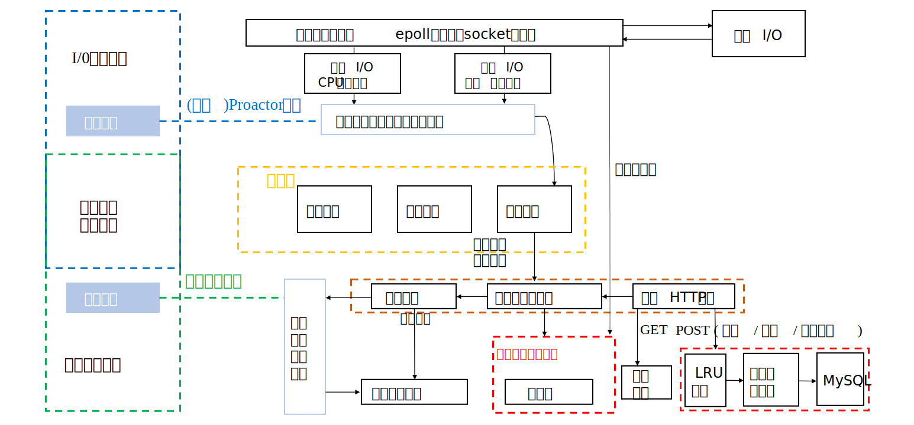
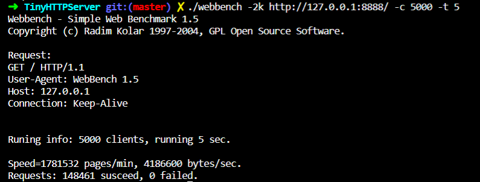
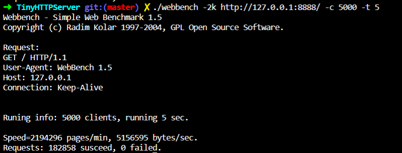
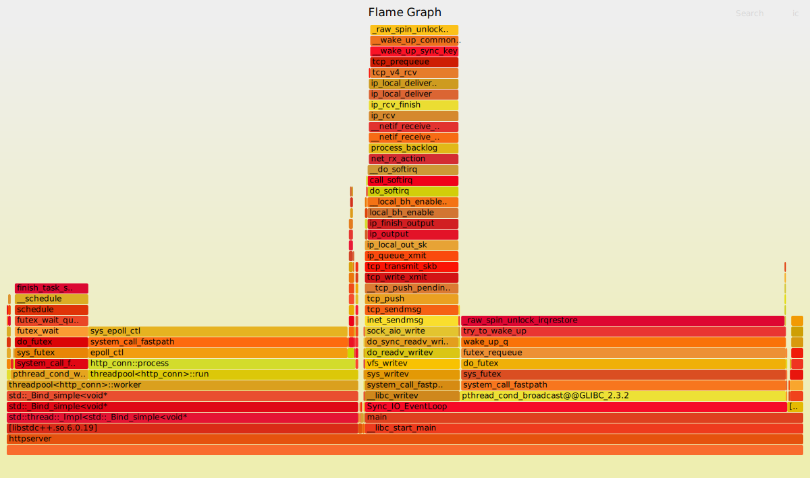
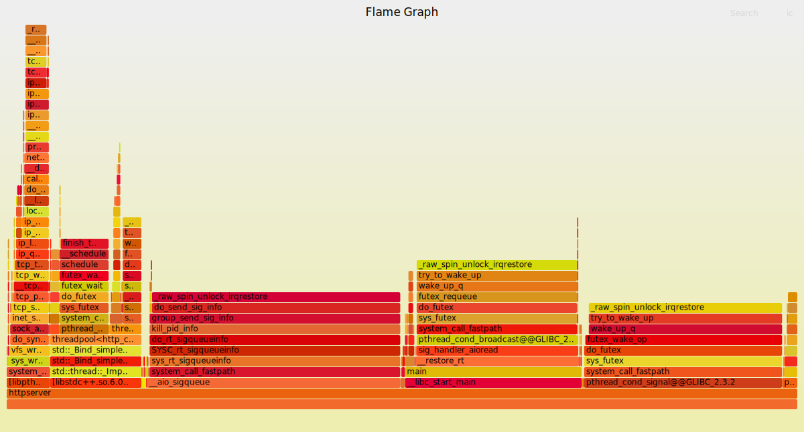

# TinyHTTPServer 项目
*********

## **项目简介**  
该项目旨在学习网络编程,Linux编程等,实现了基于Linux平台的C++轻量级Web服务器,同时在应用层搭建了一个简单的HTTP服务器  
* 应用状态机**实现GET/POST两种请求解析**,并且可对GET请求做出应答;  
* 支持**同步/异步日志系统**,记录客户端连接等信息;  
* 服务器连接MySQL数据库,Web端能够简单实现**用户注册/登录**访问功能.  
* 服务器能够自动关闭非活跃的客户端连接;  
* 经WebBench压力测试,该服务器至少支持**上千客户端的并发连接**。
*********

## **技术要点**
* **基于epoll的IO多路复用 + 非阻塞IO + ET边沿触发**,使用模拟Proactor模型,
    主线程负责接收信号和事件，子线程负责处理客户请求;  
* 利用多线程机制提供服务，增加并行服务数量，使用**线程池**减少频繁创建线程的开销;  
* 采用匿名管道接收信号,主线程统一事件源,epoll事件表一并接收信号和客户请求;  
* 使用**时间轮结构实现定时器**，对非活动客户端连接自动关闭;  
* 手写简易LRU缓存 + 数据库连接池, 避免频繁地访问数据库内容;  
* 新增**异步IO实现Proactor模型**, 并且对比模拟Proactor模型在Linux平台上进行简单的性能分析。
*********

## **项目框架**


## **开发部署环境**
- 服务器运行环境
    * 操作系统: Centos7 3.10.0
    * 数据库: MySQL 5.7.36
- 浏览器测试环境
    * Linux平台
    * Firefox浏览器
- 开发工具
    * 编辑器: Vim
    * 编译器: g++ 4.8.5
    * 构建工具: Makefile
    * 版本控制工具: Git
    * 压测工具: WebBench
*********

## **构建&启动**
- 使用前确认已安装MySQL数据库  
    ```
    //建立用户信息库
    create database WEBSERVERUSERS;
    //使用用户信息库并创建表
    use WEBSERVERUSERS;
    create table users (
        username char(50) primary key,
        password char(50) not null
    );
    //查看
    select username, password from users;
    ```
- 修改httpserver.cpp中数据库启动信息  
    ```
    m_connPool->init("localhost", "root"/*mysql name*/, "123456Abc##"/*mysql password*/,  
    "WEBSERVERUSERS"/*database name*/, 3306, 8, 0);
    ```
- 构建项目
    ```
    make
    ```
- 启动
    ```
    ./httpserver 127.0.0.1/*IP Address*/ 8888/*Port*/ 1/*Log Mode*/ 1/*I/O Mode*/
    ```
- 压力测试
    ```
    ./WebBench -2k -c 5000 -t 5 http://127.0.0.1:8888/
    ```

## **模型性能比对**  
- 压力测试结果对比 (5000 客户端连接, 持续5s)
    - 同步I/O 模拟Proactor模型测试结果
    
    - 异步I/O Proactor模型测试结果
    
- On CPU 堆栈分析
    - 同步I/O 模拟Proactor火焰图
    
    - 异步I/O Proactor火焰图
    

